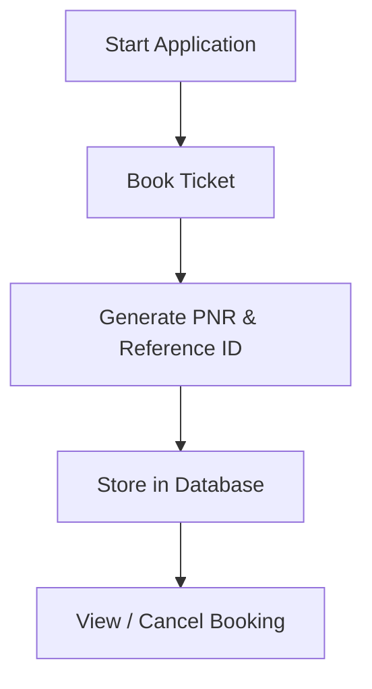

# 🚌 College Bus Booking System


> 🚀 A **Java desktop application** to streamline and automate college bus booking with secure database integration.

---

## ✨ Overview

The **College Bus Booking System** is designed to efficiently manage transportation within a college campus.
It enables users to **book buses, generate unique PNR & Reference IDs, and cancel bookings seamlessly**, reducing manual work and improving accuracy.

---

## 🎯 Key Features

✔️ Book bus tickets easily
✔️ Auto-generate **PNR & Reference ID**
✔️ Cancel bookings instantly
✔️ Secure data storage with MySQL
✔️ Interactive GUI using Java Swing
✔️ Fast and organized system

---

## 🖥️ Tech Stack

| Layer           | Technology                       |
| --------------- | -------------------------------- |
| 🎨 Frontend     | Java Swing, AWT                  |
| ⚙️ Backend      | MySQL                            |
| 🔗 Connectivity | JDBC                             |
| 🛠️ Tools       | Apache NetBeans, MySQL Workbench |

---

## 🧠 Concepts Implemented

### 🔹 Object-Oriented Programming (OOP)

* Modular structure using classes & objects
* Improves scalability and maintainability

### 🔹 GUI Development (Java Swing)

* Components used:

  * `JFrame`, `JButton`, `JLabel`, `JTable`

### 🔹 Event Handling

* `ActionListener` for user interaction

### 🔹 Database Management

* MySQL for structured and secure data

### 🔹 JDBC

* Connects Java app to database
* Executes SQL queries

### 🔹 SQL Operations

* Insert, Update, Delete, Select

### 🔹 Exception Handling

* Prevents crashes using `try-catch`

### 🔹 MVC Architecture

* **Model** → Database
* **View** → UI
* **Controller** → Logic

---

## 🔄 Workflow



---

## ⚙️ Installation & Setup

```bash
# Clone the repository
git clone https://github.com/your-username/college-bus-booking-system.git

# Open in Apache NetBeans
# Configure MySQL Database
# Update JDBC credentials
# Run the project

## 🚀 Future Enhancements

* 🌐 Web / Mobile version
* 💳 Payment gateway integration
* 📍 Real-time bus tracking
* 👥 Multi-user login system
* 📊 Admin dashboard


## 🤝 Contributing
Contributions are welcome!
Feel free to fork the repo and submit a pull request.

## 📜 License
This project is licensed under the **MIT License**

## ⭐ Support
If you like this project, give it a ⭐ on GitHub!
