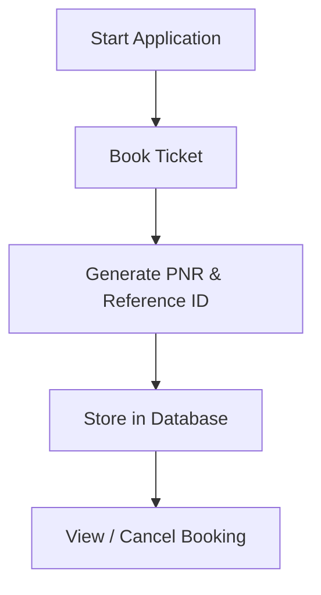

# 🚌 College Bus Booking System


> 🚀 A **Java desktop application** to streamline and automate college bus booking with secure database integration.

---

## ✨ Overview

The **College Bus Booking System** is designed to efficiently manage transportation within a college campus.
It enables users to **book buses, generate unique PNR & Reference IDs, and cancel bookings seamlessly**, reducing manual work and improving accuracy.

---

## 🎯 Key Features

✔️ Book bus tickets easily
✔️ Auto-generate **PNR & Reference ID**
✔️ Cancel bookings instantly
✔️ Secure data storage with MySQL
✔️ Interactive GUI using Java Swing
✔️ Fast and organized system

---

## 🖥️ Tech Stack

| Layer           | Technology                       |
| --------------- | -------------------------------- |
| 🎨 Frontend     | Java Swing, AWT                  |
| ⚙️ Backend      | MySQL                            |
| 🔗 Connectivity | JDBC                             |
| 🛠️ Tools       | Apache NetBeans, MySQL Workbench |

---

## 🧠 Concepts Implemented

### 🔹 Object-Oriented Programming (OOP)

* Modular structure using classes & objects
* Improves scalability and maintainability

### 🔹 GUI Development (Java Swing)

* Components used:

  * `JFrame`, `JButton`, `JLabel`, `JTable`

### 🔹 Event Handling

* `ActionListener` for user interaction

### 🔹 Database Management

* MySQL for structured and secure data

### 🔹 JDBC

* Connects Java app to database
* Executes SQL queries

### 🔹 SQL Operations

* Insert, Update, Delete, Select

### 🔹 Exception Handling

* Prevents crashes using `try-catch`

### 🔹 MVC Architecture

* **Model** → Database
* **View** → UI
* **Controller** → Logic

---

## 🔄 Workflow



---

## ⚙️ Installation & Setup

```bash
# Clone the repository
git clone https://github.com/your-username/college-bus-booking-system.git

# Open in Apache NetBeans
# Configure MySQL Database
# Update JDBC credentials
# Run the project
---

## 🚀 Future Enhancements

* 🌐 Web / Mobile version
* 💳 Payment gateway integration
* 📍 Real-time bus tracking
* 👥 Multi-user login system
* 📊 Admin dashboard

---

## 🤝 Contributing

Contributions are welcome!
Feel free to fork the repo and submit a pull request.

---

## 📜 License

This project is licensed under the **MIT License**

---

## ⭐ Support

If you like this project, give it a ⭐ on GitHub!

---

### 🔥 Why this is better

* Badges give **instant visual info about tech & status** ([ravibaghel.com][1])
* Clean sections improve readability (important for project impression) ([Wikipedia][2])
* Structured README increases discoverability and professionalism

---

If you want next upgrade, I can:

* Add **GitHub stats (stars, forks, profile badges)**
* Create a **killer demo GIF section**
* Or make it **resume/placement optimized (VERY useful for you)**

[1]: https://www.ravibaghel.com/blog/crafting-the-perfect-github-readme-best-practices-in-markdown/?utm_source=chatgpt.com "Crafting the Perfect GitHub README: Best Practices in ..."
[2]: https://en.wikipedia.org/wiki/README?utm_source=chatgpt.com "README"


# college-bus-booking-system
The College Bus Booking System is a Java-based desktop application designed to manage college transportation efficiently.
The system allows authorized users to book buses, generate unique PNR and Reference ID, and cancel bookings easily.
It uses MySQL as the backend database to store and retrieve booking details securely. 
This system reduces manual work, improves accuracy, and provides an organized approach to bus management.
## TECHNOLOGIES USED
### Frontend: Java Swing, AWT
### Backend: MySQL 
### Connectivity: JDBC
### Tools: Apache NetBeans, MySQL Workbench
## CONCEPTS USED
### Object-Oriented Programming (OOP):
Classes and objects used for modular design
Improves code reusability and maintainability
### Java Swing (GUI Programming):
Used to design user interface
Components like JFrame,  JButton,  JLabel,  Jtable
### Event Handling:
ActionListener handles button click events
Enables user interaction with the system
### Database Management System (DBMS):
MySQL used for data storage
Ensures structured and secure data management
### JDBC (Java Database Connectivity):
Connects Java application with MySQL database
Executes SQL queries from Java
### SQL (Structured Query Language):
Used for insert, update, delete, and select operations
Manages booking and cancellation data
### Modular Programming:
Application divided into multiple functional modules
Improves readability and scalability
### Exception Handling:
try-catch blocks handle runtime errors
Prevents system crashes
### MVC Architecture (Basic):
Model: MySQL Database 
View: Java Swing UI 
Controller: Java application logic
